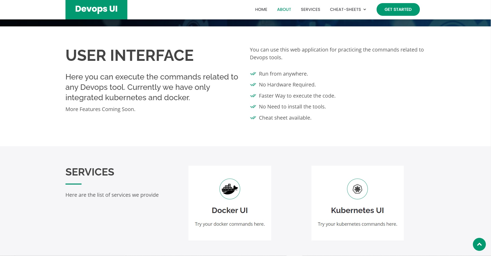

# DevOps_UI
📌Created a  𝐖𝐞𝐛𝐔𝐈 named as 𝐃𝐞𝐯𝐨𝐩𝐬 𝐔𝐈 where you can practice your 𝐊𝐮𝐛𝐞𝐫𝐧𝐞𝐭𝐞𝐬 and 𝐃𝐨𝐜𝐤𝐞𝐫 commands without worrying about the cluster setup and other environment configuration.  
📌Steps for deploying the code and website on your server: 
👉Just download the repository and put everything inside the "/var/www/html" folder of your OS where your webserver is running 
👉From the repository move the "cgi-bin" folder to "/var/www" path in your OS where your web server is running ts and delete the empty "cgi-bin" folder already available there 
👉Now make both the files of the cgi-bin folder executable 
👉Now give permissions to Apache webserver for running docker and kubernetes commands 
👉Thats all, now you just need to start your webserver and you can access the webpage from your servers ip 
📌Python must be installed in your system

<h4> Home Page View <h4>

 

